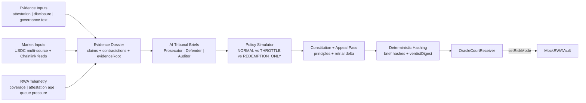

# Oracle Court — Constitutional AI Risk Governor for Tokenized Assets (Chainlink CRE)

`#defi-tokenization #cre-ai`

Oracle Court is a **constitutional tribunal workflow** where:

- an AI-style reasoning layer interprets ambiguous issuer evidence,
- CRE deterministically compiles + hashes the reasoning,
- and onchain contracts enforce the selected protocol policy.

This implementation already ships:

- Evidence Dossier generation from unstructured/semi-structured text
- Deterministic Prosecutor / Defender / Auditor briefs with citations
- Optional schema-validated model-generated findings layered on top of the deterministic briefs
- Contradiction matrix + admissibility/freshness scoring
- Counterfactual policy simulation (`NORMAL`, `THROTTLE`, `REDEMPTION_ONLY`)
- Constitutional principle checks + appeal/retrial delta output
- Onchain verdict commit + vault policy enforcement via `setRiskMode(mode)`
- Canonical proof flow with real post-verdict `mint` / `redeem` transactions
- Onchain case docket keyed by `caseId`, including prior-case and appeal lineage

---

## Latest Sepolia Verification

Current deployed stack:

- `OracleCourtReceiver`: `0x4f89381387bcc29a4f7d12581314d69fad2bb67d`
- `MockRWAVault`: `0xd5c7fad217fa3b0ba8b03e962723b48aaa153d20`

Deployment transactions:

- Vault deploy: `0xd0456fcd929d25923538f42816743d792257e3ff03e67d154d11590af0a7a5a0`
- Receiver deploy: `0x49788a43d88dcc2af47ad95cecdc403aaefc9dfbc27a287813627d14cfb7491f`
- `setCourt`: `0xebffa9a4a84af9fa9eac5a5b87de452f07ff676550daa5436fb0e21704efe135`

Verified canonical proof writes:

- Healthy tribunal tx: `0x182d29d3f997e1b903c4e39cd438fafc3a0545b5f7d1b128e20b35e503ca31a8`
- Stressed tribunal tx: `0xa6e1e02f4c21515c037a1d5ef2ba52b089c5a8c117c576ea140b7ae2b5a7e558`
- Appeal tribunal tx: `0x6dda1f34ccfdd4cd27c94b6ab325292870068d8a206d81eac07dfe85356be44e`

Verified post-verdict user action writes:

- Healthy `mint(5000)` tx: `0x535e26a7e32168c780f96da19b8d0c35c539d0776117a95db23c97a871f536bd`
- Healthy `redeem(1000)` tx: `0x01431e4d3bce457ae9ed1e10335635be92ce995927cf95a96c365c363cbc3361`
- Stressed `mint(5000)` reverted tx: `0x3cd16554aa2c8e0a178ece4a4c379e39ac9a0293a18735ba5c6117f0056437f4`
- Stressed `redeem(1000)` tx: `0x9470f63c0386513846b78729962004fc660633582511c1e6d73c5bc8c8abc296`
- Appeal `mint(5000)` tx: `0xddb1430ddc97cd0acafe07978dcc7d64ab9ea14e716153c593a2941f75e7d093`
- Appeal `redeem(1000)` tx: `0x54c0548bc37f5b84cac6cd383c849896df5b4cd52dfd3153aff28bca111b242a`

Latest onchain state after the canonical proof run:

- `latestCaseId = 0x41568898e5875dc9e77765ad3dcc847b1fff4fd28d34f44afec5f27d31364896`
- `latestPriorCaseId = 0x34022771d62bd3573499ce493d96854284bb23a7f94bcc23ca2e2049ea05f451`
- `latestAppealOfCaseId = 0x34022771d62bd3573499ce493d96854284bb23a7f94bcc23ca2e2049ea05f451`
- `latestAppealOutcome = RELAX`
- `latestMode = NORMAL`
- `latestRiskScoreBps = 5566`
- `vault totalMinted = 20000`
- `vault totalRedeemed = 6000`
- `vault actor balance = 14000`

This confirms the upgraded receiver now behaves like a docket and that Oracle Court produces real protocol impact evidence, not just mode changes. In the stressed case, the policy simulator selected `THROTTLE`, the effective mode remained `THROTTLE`, and a real `mint(5000)` reverted onchain while redemption stayed available.

---

## Canonical Demo Story (judge quick-pass)

Three-step narrative used in the final proof package:

1. **Healthy evidence + telemetry** (`reserveCoverageBps=10000`, `attestationAgeSeconds=300`, `redemptionQueueBps=200`)
   - mode: `NORMAL`
   - policy effect: `mint(5000)` and `redeem(1000)` both succeeded onchain
2. **Stressed evidence + contradictions** (`reserveCoverageBps=9400`, `attestationAgeSeconds=172800`, `redemptionQueueBps=2800`)
   - mode: `THROTTLE`
   - policy effect: `mint(5000)` reverted onchain, `redeem(1000)` still succeeded
3. **Appeal / retrial evidence + improved telemetry** (`reserveCoverageBps=9900`, `attestationAgeSeconds=7200`, `redemptionQueueBps=700`)
   - mode: `NORMAL`
   - policy effect: `mint(5000)` and `redeem(1000)` were restored successfully onchain
4. Each verdict is committed onchain and immediately enforced by `OracleCourtReceiver -> MockRWAVault.setRiskMode(mode)`.

Canonical proof files:

- `artifacts/oracle-court-canonical-proof.json`
- `artifacts/oracle-court-proof-package.md`
- `artifacts/oracle-court-policy-impact.md`
- `artifacts/oracle-court-healthy-scenario.json`
- `artifacts/oracle-court-stressed-scenario.json`
- `artifacts/oracle-court-appeal-scenario.json`

The checked-in canonical package above is the current regenerated Sepolia proof set for the upgraded docketed stack.
It reflects the deterministic tribunal path; the optional model-generated findings layer is implemented in code but not part of the checked-in live proof artifacts.

---

## Architecture



---

## AI-Native Tribunal Flow

### 1) Evidence Dossier (ambiguity handling)

Oracle Court reads configured dossier documents (`reserveAttestation`, `issuerDisclosure`, `governanceProposal`, etc), chunks them, extracts claims, and builds:

- `claims[]` (topic, polarity, confidence, source IDs)
- `contradictionMatrix[]`
- `admissibilityScoreBps`
- `evidenceFreshnessScoreBps`
- `evidenceRoot` (canonical digest)

### 2) Adversarial briefs

Each agent emits a full brief:

- `position`
- `thesis`
- `claims[]`
- `citations[]`
- `contradictionsFound[]`
- `policyRecommendation`
- `confidenceBps`

Each brief is hashed with stable canonical JSON:

- `prosecutorEvidenceHash`
- `defenderEvidenceHash`
- `auditorEvidenceHash`

These deterministic briefs are still the policy-decision source of truth. An optional `model` path can call a language model through CRE confidential HTTP, validate the returned JSON against schema + real dossier IDs, and attach supplemental findings to the tribunal briefs. When that model layer is accepted, the brief hashes and verdict digest are recomputed over the augmented briefs before the report is written onchain.

### 3) Contradiction analysis

The dossier pass explicitly checks narrative-vs-telemetry conflicts, e.g.:

- “reserves sufficient” vs deteriorating `reserveCoverageBps`
- “redemptions normal” vs high `redemptionQueueBps`
- “fresh attestation” vs stale `attestationAgeSeconds`

### 4) Counterfactual policy simulation

Oracle Court scores all three policy modes and compares:

- solvency protection
- user harm
- false-positive cost
- operational reversibility

The policy simulator produces a provisional mode, then constitutional gates can downgrade enforcement if restrictive action lacks sufficient admissible/fresh evidence.

### 5) Constitutional + appeal layer

Final decision cites principles:

- Solvency First
- Orderly Exit
- Minimum Necessary Restriction
- Evidence Sufficiency
- Freshness Requirement

And emits `appealOutcome` relative to the prior onchain case summary (`ESCALATE` / `RELAX` / `MAINTAIN` / `NO_PRIOR_CASE`).

### 6) Deterministic commit + onchain enforcement

CRE writes a signed report to `OracleCourtReceiver`, which stores verdict state, persists appeal-summary fields (contradiction count/severity, freshness, admissibility), and calls:
- `getCaseSummary(caseId)` exposes the docketed case summary onchain
- `hasCase(caseId)` allows existence checks for audit/replay flows

- `MockRWAVault.setRiskMode(mode)`

Vault behavior:

- `NORMAL` → mint + redeem allowed
- `THROTTLE` → mint limited by `throttleMintLimit`
- `REDEMPTION_ONLY` → mint disabled, redeem allowed

Canonical proof scripts then execute real `mint` / `redeem` transactions to prove the enforced behavior with live Sepolia tx hashes.

---

## Reliability Features

- Multi-source median for offchain USDC
- Retry with deterministic backoff logging
- Per-source status logs (`OK`, `FAILED`, `SKIPPED`)
- Partial-source tolerance with `minSuccessfulSources`
- Call-budget guard (`maxHttpCalls`)

---

## Repository Layout

```text
contracts/
  MockRWAVault.sol
  OracleCourtReceiver.sol
  deployments/
    sepolia-oracle-court-stack.json

scripts/
  deploy-oracle-court-stack.ts
  sync-oracle-court-config.ts
  set-oracle-court-rwa-telemetry.ts
  demo-oracle-court-policy-impact.ts
  generate-oracle-court-proof.ts
  oracle-court-vault-actions.ts
  build-oracle-court-canonical-proof.ts
  read-oracle-court-state.ts

src/workflows/oracle-court/
  index.ts
  canonical.ts
  dossier.ts
  model-findings.ts
  tribunal.ts
  policy-simulator.ts
  appeal.ts
  model-findings.test.ts
  workflow.yaml
  config.template.json
  config.generated.json   # generated automatically

artifacts/
  oracle-court-sim-latest.log
  oracle-court-simulation-output.txt
  oracle-court-proof.md
  oracle-court-policy-impact.md
  oracle-court-canonical-proof.json
  oracle-court-proof-package.md
  oracle-court-healthy-scenario.json
  oracle-court-stressed-scenario.json
  oracle-court-appeal-scenario.json
  evidence-dossier.json
  evidence-dossier.md
  tribunal-briefs.md
  policy-simulation.md
  verdict-bulletin.json
  ARTIFACT_MAP.md
```

---

## Reproducible Run (no manual config edits)

```bash
git clone https://github.com/crabbymccrabcakes/chainlink-cre-hackathon.git
cd chainlink-cre-hackathon
bun install
bun run setup
```

Set env:

```bash
export CRE_ETH_PRIVATE_KEY="0x<funded-sepolia-private-key>"
# optional
export SEPOLIA_RPC_URL="https://por.bcy-p.metalhosts.com/cre-alpha/MvqtrdftrbxcP3ZgGBJb3bK5/ethereum/sepolia"
```

Optional model findings:

- Set `model.enabled=true` in `src/workflows/oracle-court/config.template.json` before syncing config.
- For `local-simulation`, `bun run sync:oracle-court:config` copies `OPENAI_API_KEY` (or the configured `model.apiKeySecretId`) into an untracked local config file used only by the local target.
- For live CRE confidential execution, store the API key in CRE secrets under the configured `model.apiKeySecretId` / `model.apiKeySecretNamespace`, then provision it with `cre secrets create <secrets-file.yaml>`.
- If the secret or model call is unavailable, Oracle Court logs a model-layer fallback and continues with deterministic tribunal briefs only.

Local-only model path:

```bash
export OPENAI_API_KEY="sk-..."
export ORACLE_COURT_MODEL_ENABLED=true
bun run simulate:oracle-court
```

This uses ordinary local HTTP for the model call during `local-simulation`. It does not require deploy access, writes the key only to `src/workflows/oracle-court/config.local.generated.json`, and is not the confidential CRE path.

Exact provisioning flow for the current config (`model.apiKeySecretId=OPENAI_API_KEY`, namespace `default`):

```bash
# 1. Put the OpenAI key in your local .env (do not commit it)
echo 'OPENAI_API_KEY=sk-...' >> .env

# 2. Use the example secret manifest
cp secrets.oracle-court.example.yaml secrets.oracle-court.yaml

# 3. Log in to CRE if needed
bun x cre login

# 4. Create the secret in Vault DON
bun x cre secrets create secrets.oracle-court.yaml --yes

# 5. Optionally verify it exists
bun x cre secrets list
```

Notes:

- `secrets.oracle-court.yaml` only lists the secret names; the values are read from `.env`.
- The YAML is namespace-keyed. For the current config it should be:
  `secretsNames: { default: [OPENAI_API_KEY] }`
- If you use `--unsigned`, CRE also requires `project.yaml` to set `account.workflow-owner-address`.
- After provisioning the secret, enable `model.enabled=true`, run `bun run sync:oracle-court:config`, then run a simulation or broadcast proof.

Deploy + sync:

```bash
bun run deploy:oracle-court:stack
```

Broadcast simulation + proof artifacts:

```bash
bun run simulate:oracle-court:broadcast
```

Read onchain state:

```bash
bun run read:oracle-court:state
```

Policy-impact + appeal demo:

```bash
bun run demo:oracle-court:impact
```

Build canonical healthy->stressed->appeal proof package (used in submission):

```bash
bun run proof:oracle-court:canonical
```

Run tests:

```bash
bun test
```

---

## Security Note

Current receiver accepts reports for simulation convenience.
Production hardening should gate report delivery by trusted forwarder + workflow metadata policy.
