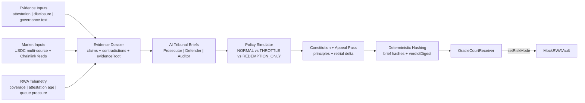

# Oracle Court — Constitutional AI Risk Governor for Tokenized Assets (Chainlink CRE)

`#defi-tokenization #cre-ai`

Oracle Court is a **constitutional tribunal workflow** where:

- an AI-style reasoning layer interprets ambiguous issuer evidence,
- CRE deterministically compiles + hashes the reasoning,
- and onchain contracts enforce the selected protocol policy.

This implementation already ships:

- Evidence Dossier generation from unstructured/semi-structured text
- Adversarial Prosecutor / Defender / Auditor briefs with citations
- Contradiction matrix + admissibility/freshness scoring
- Counterfactual policy simulation (`NORMAL`, `THROTTLE`, `REDEMPTION_ONLY`)
- Constitutional principle checks + appeal/retrial delta output
- Onchain verdict commit + vault policy enforcement via `setRiskMode(mode)`
- Canonical proof flow with real post-verdict `mint` / `redeem` transactions
- Onchain case docket keyed by `caseId`, including prior-case and appeal lineage

---

## Latest Sepolia Verification

Current deployed stack:

- `OracleCourtReceiver`: `0x4f89381387bcc29a4f7d12581314d69fad2bb67d`
- `MockRWAVault`: `0xd5c7fad217fa3b0ba8b03e962723b48aaa153d20`

Deployment transactions:

- Vault deploy: `0xd0456fcd929d25923538f42816743d792257e3ff03e67d154d11590af0a7a5a0`
- Receiver deploy: `0x49788a43d88dcc2af47ad95cecdc403aaefc9dfbc27a287813627d14cfb7491f`
- `setCourt`: `0xebffa9a4a84af9fa9eac5a5b87de452f07ff676550daa5436fb0e21704efe135`

Verified canonical proof writes:

- Healthy tribunal tx: `0xc66c3a8acdc86e19ba95e5d879fd748a963a0d8af63f8077e9f1203c76593923`
- Stressed tribunal tx: `0x8831b18c70c477ec20a889bd701753278dd16ccaccdfa89902fce2974d0c3c4f`
- Appeal tribunal tx: `0x4128f84408bb25e7589a1346f1db07eaf825d478500265851a61ef10ef5c3d0d`

Verified post-verdict user action writes:

- Healthy `mint(5000)` tx: `0x20ce725020e635476b57772b5c7dae0b0630bf1ad6acfcc4de2b9ddd208739fe`
- Healthy `redeem(1000)` tx: `0x80f22e9bfd80eedc3acd674807c3558664badbef30fb2e39420d328114edf9e2`
- Stressed `mint(5000)` reverted tx: `0x5cd7ccd06c5ad11e3d8333ae2527a50abcd26ef97ef413982a5c78ccc2f57e2c`
- Stressed `redeem(1000)` tx: `0x16162843eeef745d7c93cb7b6d39f3110d144444ef764c52639a04b7fea43abd`
- Appeal `mint(5000)` tx: `0x52620c33e483cce65cf591cf6a801ee60d14ea656faea099646df1c09ea55889`
- Appeal `redeem(1000)` tx: `0x2006a30c7899dd70256be9a35c9ed9c0f10ebec2589119f91e56410cfbabf95f`

Latest onchain state after the canonical proof run:

- `latestCaseId = 0x0be49818d3346f3c5d4d08fac0e482a4987aa15922e1fd516a95e9684087f844`
- `latestPriorCaseId = 0x17ec24f0578fb950403e9d064634ff96214d409d5b451aa6344fc9e5c20a4383`
- `latestAppealOfCaseId = 0x17ec24f0578fb950403e9d064634ff96214d409d5b451aa6344fc9e5c20a4383`
- `latestAppealOutcome = RELAX`
- `latestMode = NORMAL`
- `latestRiskScoreBps = 5567`
- `vault totalMinted = 10000`
- `vault totalRedeemed = 3000`
- `vault actor balance = 7000`

This confirms the upgraded receiver now behaves like a docket and that Oracle Court produces real protocol impact evidence, not just mode changes. In the stressed case, the policy simulator selected `THROTTLE`, the effective mode remained `THROTTLE`, and a real `mint(5000)` reverted onchain while redemption stayed available.

---

## Canonical Demo Story (judge quick-pass)

Three-step narrative used in the final proof package:

1. **Healthy evidence + telemetry** (`reserveCoverageBps=10000`, `attestationAgeSeconds=300`, `redemptionQueueBps=200`)
   - mode: `NORMAL`
   - policy effect: `mint(5000)` and `redeem(1000)` both succeeded onchain
2. **Stressed evidence + contradictions** (`reserveCoverageBps=9400`, `attestationAgeSeconds=172800`, `redemptionQueueBps=2800`)
   - mode: `THROTTLE`
   - policy effect: `mint(5000)` reverted onchain, `redeem(1000)` still succeeded
3. **Appeal / retrial evidence + improved telemetry** (`reserveCoverageBps=9900`, `attestationAgeSeconds=7200`, `redemptionQueueBps=700`)
   - mode: `NORMAL`
   - policy effect: `mint(5000)` and `redeem(1000)` were restored successfully onchain
4. Each verdict is committed onchain and immediately enforced by `OracleCourtReceiver -> MockRWAVault.setRiskMode(mode)`.

Canonical proof files:

- `artifacts/oracle-court-canonical-proof.json`
- `artifacts/oracle-court-proof-package.md`
- `artifacts/oracle-court-policy-impact.md`
- `artifacts/oracle-court-healthy-scenario.json`
- `artifacts/oracle-court-stressed-scenario.json`
- `artifacts/oracle-court-appeal-scenario.json`

The checked-in canonical package above is the current regenerated Sepolia proof set for the upgraded docketed stack.

---

## Architecture



---

## AI-Native Tribunal Flow

### 1) Evidence Dossier (ambiguity handling)

Oracle Court reads configured dossier documents (`reserveAttestation`, `issuerDisclosure`, `governanceProposal`, etc), chunks them, extracts claims, and builds:

- `claims[]` (topic, polarity, confidence, source IDs)
- `contradictionMatrix[]`
- `admissibilityScoreBps`
- `evidenceFreshnessScoreBps`
- `evidenceRoot` (canonical digest)

### 2) Adversarial briefs

Each agent emits a full brief:

- `position`
- `thesis`
- `claims[]`
- `citations[]`
- `contradictionsFound[]`
- `policyRecommendation`
- `confidenceBps`

Each brief is hashed with stable canonical JSON:

- `prosecutorEvidenceHash`
- `defenderEvidenceHash`
- `auditorEvidenceHash`

### 3) Contradiction analysis

The dossier pass explicitly checks narrative-vs-telemetry conflicts, e.g.:

- “reserves sufficient” vs deteriorating `reserveCoverageBps`
- “redemptions normal” vs high `redemptionQueueBps`
- “fresh attestation” vs stale `attestationAgeSeconds`

### 4) Counterfactual policy simulation

Oracle Court scores all three policy modes and compares:

- solvency protection
- user harm
- false-positive cost
- operational reversibility

The policy simulator produces a provisional mode, then constitutional gates can downgrade enforcement if restrictive action lacks sufficient admissible/fresh evidence.

### 5) Constitutional + appeal layer

Final decision cites principles:

- Solvency First
- Orderly Exit
- Minimum Necessary Restriction
- Evidence Sufficiency
- Freshness Requirement

And emits `appealOutcome` relative to the prior onchain case summary (`ESCALATE` / `RELAX` / `MAINTAIN` / `NO_PRIOR_CASE`).

### 6) Deterministic commit + onchain enforcement

CRE writes a signed report to `OracleCourtReceiver`, which stores verdict state, persists appeal-summary fields (contradiction count/severity, freshness, admissibility), and calls:
- `getCaseSummary(caseId)` exposes the docketed case summary onchain
- `hasCase(caseId)` allows existence checks for audit/replay flows

- `MockRWAVault.setRiskMode(mode)`

Vault behavior:

- `NORMAL` → mint + redeem allowed
- `THROTTLE` → mint limited by `throttleMintLimit`
- `REDEMPTION_ONLY` → mint disabled, redeem allowed

Canonical proof scripts then execute real `mint` / `redeem` transactions to prove the enforced behavior with live Sepolia tx hashes.

---

## Reliability Features

- Multi-source median for offchain USDC
- Retry with deterministic backoff logging
- Per-source status logs (`OK`, `FAILED`, `SKIPPED`)
- Partial-source tolerance with `minSuccessfulSources`
- Call-budget guard (`maxHttpCalls`)

---

## Repository Layout

```text
contracts/
  MockRWAVault.sol
  OracleCourtReceiver.sol
  deployments/
    sepolia-oracle-court-stack.json

scripts/
  deploy-oracle-court-stack.ts
  sync-oracle-court-config.ts
  set-oracle-court-rwa-telemetry.ts
  demo-oracle-court-policy-impact.ts
  generate-oracle-court-proof.ts
  oracle-court-vault-actions.ts
  build-oracle-court-canonical-proof.ts
  read-oracle-court-state.ts

src/workflows/oracle-court/
  index.ts
  canonical.ts
  dossier.ts
  tribunal.ts
  policy-simulator.ts
  appeal.ts
  workflow.yaml
  config.template.json
  config.generated.json   # generated automatically

artifacts/
  oracle-court-sim-latest.log
  oracle-court-simulation-output.txt
  oracle-court-proof.md
  oracle-court-policy-impact.md
  oracle-court-canonical-proof.json
  oracle-court-proof-package.md
  oracle-court-healthy-scenario.json
  oracle-court-stressed-scenario.json
  oracle-court-appeal-scenario.json
  evidence-dossier.json
  evidence-dossier.md
  tribunal-briefs.md
  policy-simulation.md
  verdict-bulletin.json
  ARTIFACT_MAP.md
```

---

## Reproducible Run (no manual config edits)

```bash
git clone https://github.com/crabbymccrabcakes/chainlink-cre-hackathon.git
cd chainlink-cre-hackathon
bun install
bun run setup
```

Set env:

```bash
export CRE_ETH_PRIVATE_KEY="0x<funded-sepolia-private-key>"
# optional
export SEPOLIA_RPC_URL="https://por.bcy-p.metalhosts.com/cre-alpha/MvqtrdftrbxcP3ZgGBJb3bK5/ethereum/sepolia"
```

Deploy + sync:

```bash
bun run deploy:oracle-court:stack
```

Broadcast simulation + proof artifacts:

```bash
bun run simulate:oracle-court:broadcast
```

Read onchain state:

```bash
bun run read:oracle-court:state
```

Policy-impact + appeal demo:

```bash
bun run demo:oracle-court:impact
```

Build canonical healthy->stressed->appeal proof package (used in submission):

```bash
bun run proof:oracle-court:canonical
```

---

## Security Note

Current receiver accepts reports for simulation convenience.
Production hardening should gate report delivery by trusted forwarder + workflow metadata policy.
